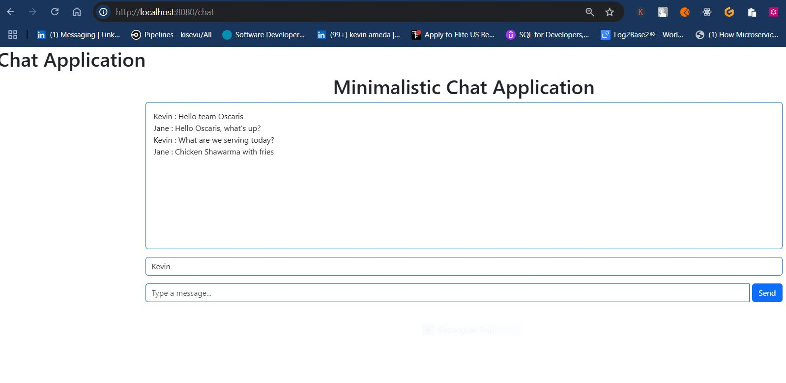
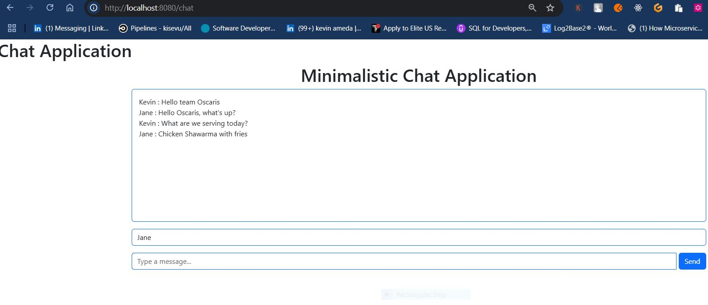

## MINIMALISTIC CHAT APPLICATION USING WEBSOCKETS, STOMP AND SOCKJS ##

The application mimics a simple, what I call a minimalistic chat functionality.
There are a couple of technologies that have been employed in terms of 
dependencies added to make the application functionality come to life.

 ***There are a few key points***
 * Websockets :
   - Is a protocol that enables full-duplex communication channels over a single long-lived connection.
   - Ideal for real-time applications.
   - The connection necessitates the sending and reception of data between the client and the server without haviing to repeatedly open and close new HTTP requests.
   - They use ws// or wss// protocol instead of http://
   - No overhead of setting up new HTTP requests.
 * STOMP (Messaging protocol):
    - A higher-level protocol built on top of websockets . While websockets define the communication channel, STOMP adds a layer to handle messaging semantics, such as routing, destinations and formats.
    - STOMP allows clients to subscribe to a particular destination and the server can send messages to that destination.
    - STOMP enables features like the publish/subscribe  and message acknowledgement to broadcast to multiple users.
 * SOCKJS (Fallback mechanism)
    - A javaScript library that provides a WebSocket-like object in the browser. It attempts to create 
   a WebSocket connection but can fall back to other transport mechanisms 
   if WebSockets are not available (i.e polling or XHR streaming).
    - SockJs ensures that WebSockets can work in environs where WebSockets 
   are not supported or blocked by firewalls, making it more reliable and cross-browser compatible.
    - Usage of it is not strictly necessary if WebSockets work reliably in your environment but makes one's application robust.

***************************************
***************************************
***************************************

## Author
**Name**: Kevin Ameda Kisevu  
**Website**: [kisevu](https://kisevu-portfolio.netlify.app/)  
**GitHub**: [@kisevu](https://github.com/kisevu)  
**Email**: amedakevin.com